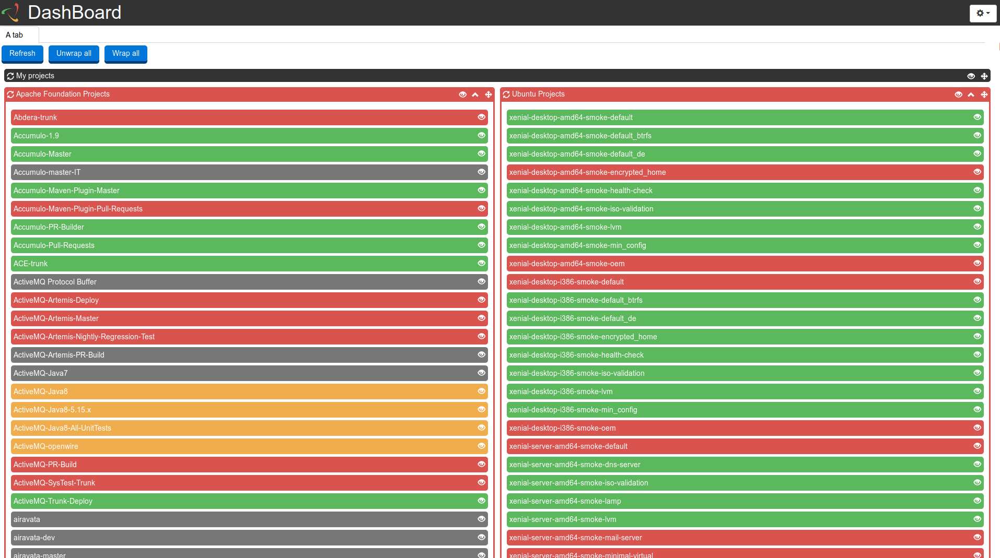

# Dashboard

Dashboard provides an interface to monitor "Jenkins" job's status for continuous integration.



## Prerequisites
* [Docker](https://docs.docker.com/)
* [npm](https://www.npmjs.com/get-npm)
* [NodeJS](https://nodejs.org/en/)

## Getting started
```
$ git clone https://github.com/pmsipilot/dashboard.git
$ cd dashboard/
```

This task will create the docker image for the dashboard, install js dependancies and build css
```
$ make docker
```

This command will launch a container from the docker image previously created in detached mode. That way, it is possible to update the code without having to rebuild the container to test it.
```
$ docker run -p 8080:3000 --name dashboard --rm -it dashboard-image
```

The application is available at the following URL : `http://localhost:8080`

## License
This project is released under the [MIT license](LICENSE)
